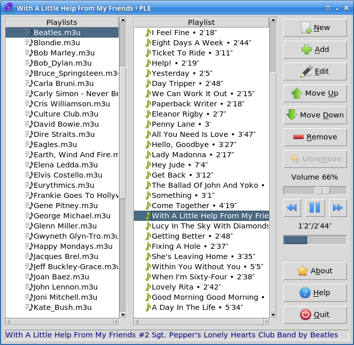

# PLE (PlayList Editor)

An easy-to-use application for creating and editing playlists, and for
playing tracks and entire playlists if the Python GStreamer bindings are
installed.

Tested on Linux using Python 3.8 and Tk 8.6.

## License

GPL-3.0.
